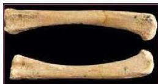
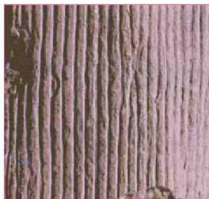
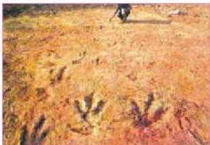

الشكل (١٢) أحفورة عظمة متعددة

الشكل (١٣) أحفورة نبات سيجيلاريا متفحمة

والمشبعة بها في الفراغات والتجاويف للأجزاء الصلبة لعظام الفقاريات، والإسفنجات والمرجانيات.

ولا يتم هنا إحلال للأجزاء الصلبة. ويقال عندها أن الكائن قد تشرب بمحليل أدت إلى ترسب مواد ذات تركيب مختلف عن تكوينه. انظر الشكل (١٢) ترى عظمة متحفرة بهذه الطريقة.

### ج- التفحم (Carbonization) :

انظر الشكل (١٣) تلاحظ أنه بقايا نبات قديم يسمى سيجيلاريا، وهي متفحمة وجدت في الطفل الأسود الذي يعتبر من أحد الدلائل على أن البيئة كانت بيئة مستنقعات.

وتتم هذه العملية عندما تدفن النباتات في رواسب طينية بعد موتها، وتتعرض إلى ضغط وحرارة عاليين، إضافة إلى عامل الزمن، فتبدأ عمليات التفحم بأن يتطاير الأكسجين والهيدروجين والنيتروجين الموجودة في خلايا النباتات ويتبقى عنصر الكربون بشكل فحم يمثل الشكل بكل تفاصيله الأصلية التي يمكن أن تعطي فكرة واضحة عن نوعه.

الشكل (١٤) آثار أقدام ديناصورات

### ٣- الآثار الأحفورية (Ichnofossils) :

هي آثار كائنات حية قديمة تمثل أنشطتها وطرق معيشتها، كآثار:

أ - سير الحيوانات (طبعات الأقدام) : مثل طبعات أقدام الديناصور التي تظهر بالشكل (١٤).

ب - آثار زحف أو حُفر، التي تحفرها

١٩٤

الأحياء للصف الثالث الثانوي