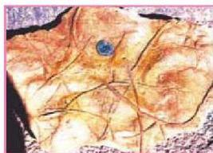
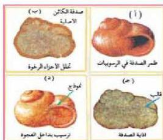

الشكل (١٥) آثار زحف ميدان

الزواحف وبعض اللافقاريات على شكل قنوات أو ممرات في الرواسب الطرية، وتتملىء بالرواسب فيما بعد، وعندما تتصل هذه الرواسب تحفظ آثار الزحف والحفر كنوع من أنواع الأحافير كما في (الشكل - ١٥).
ج- إفرازات الحيوانات: تترك بعض الحيوانات برازها الذي يتصل

ويحفظ كنوع من أنواع الأحافير مثل براز الطيور الذي يتراكم أثناء هجرتها الجماعية عند تغيير الفصول السنوية، وكذلك مخلفات الديناصورات التي وجدت مراقبة لبقاياها المتحجرة.

#### ٤- القوالب والنماذج (Molds & Casts):

تتكون القوالب والنماذج عند دفن القواقع والأصداف أو العظام.

الشكل (١٦) القالب والنموذج

انظر (الشكل - ١٦) ولاحظ كيف يتكون القالب والنموذج. تلاحظ أنه إذا طمرت قوقعة في رسوبيات كما في (الشكل - أ) تتحلل مادتها الرخوة أولاً (الشكل - ب)، ثم تعرضت لاحقاً لتخلل المحاليل التي تعمل على إذابة الصدفة (الشكل - ج)، فتتكون فجوه داخل الرسوبيات أو الصخرة تسمى قالباً (أحفورة القالب). وتلاحظ أن القالب أخذ الشكل الخارجي للقوقعة.

ويمكن أن تتكون القوالب أيضاً بأجزاء صلبة أخرى كعظام الفقاريات. أما إذا امتلا القالب فيما بعد برسوبيات طينية أو جيرية (الشكل - د)، أو ترسبت فيه معادن ناتجة من تخلل الصخرة بمحاليل مشبعة بعناصر تلزم لتكوين القالب، تنتج أحفورة تسمى نموذجاً تحمل جميع التفاصيل الداخلية للقوقعة.

#### - فوائد الأحافير:

تظهر أهمية دراسة الأحافير في النتائج التي توصل إليها العلماء، وهي:

الأحياء للصف الثالث الثانوي

١٩٥