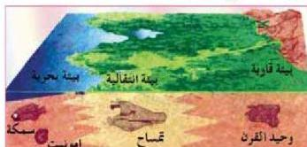

## ١- معرفة البيئات الرسوبية القديمة (Palaeoenvironment):

يقصد بها الأماكن التي عاشت فيها كائنات الأحافير. انظر الشكل (١٧) تلاحظ بيئات مختلفة لتكون أحافير عاشت في فترة زمنية واحدة.

الشكل (١٧) بيئات مختلفة لتكون أحافير عاشت في الفترة الزمنية نفسها

أ - **بيئات بحرية:** تشتمل على البحار والمحيطات المختلفة الأعماق من مناطق عميقة متوسطة وضحلة وتتميز البيئات البحرية القديمة بأنواع معينة من الأحافير.

فمثلاً الشعاب المرجانية تعيش في قيعان جيرية على عمق ضحل نسبياً، لذا فوجودها دليل على بيئة بحرية ضحلة .. وهكذا.

ب - **بيئات قارية:** تشتمل على مجاري الأنهار وضفافها، والصحاري، وحتى الجليديات القارية. وتتميز كل منها بأنواع خاصة من الكائنات، وبالتالي بأنواع معينة من الأحافير، وتسود النباتات معظم أنواع البيئات القارية.

ج - **بيئات انتقالية:** تشتمل على دنتا الأنهار والمناطق الشاطئية، وتتميز بأنواع محددة من الحياة، وبالتالي بأنواع معينة من الأحافير.

٢ - **معرفة البيئات الحياتية القديمة (Palaeoecology):** يقصد بها الظروف الحياتية القديمة التي كانت تحيط بالكائن الحي من درجة حرارة وضغط وملوحة وغذاء وغيرها. ولكل كائن ظروف مناسبة له.

فمثلاً الجلد شوكيات التي تعيش حالياً على الشواطئ الضحلة تحت ظروف حياتية معينة كدرجة الحرارة والضغط والملوحة والغذاء، إذ عثر على أحافيرها في صخور العصر الكرتياسي، فذلك يدل على أنها قد عاشت في ذلك العصر وفي بيئات بحرية ضحلة تماثل الظروف الحياتية السابقة الذكر.

## ٣- الجغرافيا القديمة (Palacogeography):

نظراً لأن الكائنات تنتشر في بيئات معينة، ذات شروط تناسب ظروفها المعيشية، فإن أحافير هذه الكائنات ترشدنا إلى معرفة حدود اليابسة والمحيطات القديمة وفي تحديد هذه العلاقة في مختلف العصور القديمة.

١٩٦

الأحياء للصف الثالث الثانوي