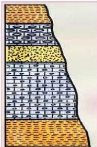

فبواسطته يتم ترتيب الطبقات ترتيباً زمنياً من الأقدم إلى الأحدث، أي أنه يخبرنا أن شيئاً ما سبق حدثاً ما وتلاه حدث آخر، لكنه لا يعطينا عمراً محدداً لحدث ما. وهناك مجموعة من المبادئ اعتبرت أساساً للتاريخ النسبي هي:

### ١- مبدأ أو قانون تعاقب الطبقات: (Law of Superposition).

وضع العالم الإيطالي «ستينو» القانون الأول في علم الطبقات وينص على أنه:

الشكل (١٨) تعاقب طبقات

في أي تتابع لطبقات الصخور الرسوبية تكون كل طبقة أحدث من الطبقة التي تقع أسفلها، وأقدم من الطبقة التي تعلوها، وبالتالي فإن الطبقات الأقدم تكون في الأسفل والطبقات الأحدث في الأعلى - ما لم تتعرض لقوى تؤدي إلى تغيير نظام تعاقبها الأصلي كالقلب أو الطي أو التصدع. انظر الشكل (١٨)، ثم اذكر اسم الطبقة الأقدم في هذا التتابع؟ والطبقة الأحدث؟

رتب الطبقات من الأقدم إلى الأحدث بإعطائها أرقاماً؟

### ٢ - مبدأ تعاقب الحياة (تعاقب المجاميع الحيوانية والنباتية):

#### (Law of Faunal and Floral Succession)

يمكن الاستدلال على تعاقب الحياة من خلال الأحافير الموجودة في الطبقات؛ حيث تستعمل الأحافير للاستدلال على العمر الجيولوجي للصخر الذي وجدت فيه، ولأغراض المضاهاة (المقارنة) بين الطبقات. لكن على ماذا يعتمد ذلك؟

يعتمد ذلك على ظاهرة تغير أنواع الحياة وتطورها عبر الزمن، فكل طبقة تتميز بظهور حياة بكائنات جديدة لم تكن موجودة في الطبقات الأقدم، واختفاء حياة كائنات لأنواع كانت موجودة في الطبقات الأقدم.

وقد عبر عن هذه الحقيقة العالم البريطاني (وليم سميث) في قانون تعاقب الحياة أو قانون الترابط الأحفوري على النحو الآتي:

كل طبقة أو مجموعة من طبقات الصخور الرسوبية تحتوي على أحافير محددة تختلف عن تلك الموجودة في الطبقات الأقدم والأحدث منها، كما في الشكل (١٩).

١٩٨

الأحياء للصف الثالث الثانوي