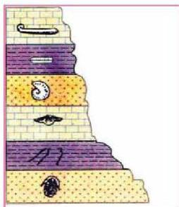
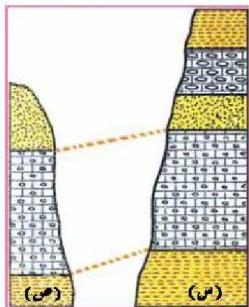

الشكل (١٩) تتابع أحفوري

وعلى هذا الأساس يمكن التعرف على زمن تكوين الطبقة أو عمرها من دراسة أنواع الأحافير فيها، كما يمكن التعرف على ترتيبها بين الطبقات الأخرى.

### ٣- المضاهاة بين الطبقات (Correlation)

ما المقصود بالمضاهاة؟ وما أنواعها؟
المضاهاة: هي مطابقة أو مقارنة الطبقات الصخرية في أماكن مختلفة على سطح الأرض عبر مسافات جغرافية قريبة أو بعيدة، وهناك نوعان من المضاهاة هما:

#### أ- المضاهاة الصخرية (Lithocorrelation)

هي عملية مضاهاة أو مطابقة بين الطبقات في أماكن مختلفة لتحديد أعمارها النسبية بالاعتماد على التشابه الصخري من حيث التركيب المعدني والخصائص الفيزيائية: كالنسيج، واللون، والتراكيب الداخلية لهذه الطبقات، ولإجراء عمليات المضاهاة الصخرية يمكن اتباع الخطوات الآتية:

الشكل (٢٠) المضاهاة الصخرية

١- دراسة الخواص والمميزات الحجرية لكل طبقة من طبقات قطاع ما، وليكن (س) كما يظهر بالشكل (٢٠).

٢- تعيين العمر الزمني للطبقات الحجرية في القطاع (س) بتطبيق قانون تعاقب الطبقات، أي بتسجيل ترتيب الطبقات على حسب تتابعها في القطاع من الأقدم إلى الأحدث.

٣- تعيين الطبقات الحجرية المشابهة للطبقات السابقة في قطاع آخر (ص).

٤- ربط الطبقات المشابهة ببعضها ببعض، وتحديد الأعمار النسبية والتعاقب الزمني لطبقات القطاع (ص). كما يلاحظ في (الشكل ٢٠).

الأحياء للصف الثالث الثانوي

١٩٩