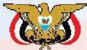

# النشيد الوطني

وعدي أيتها الدنيا تشيدي وديبه وأعيدي وأعيدي
وانكري في فرحتي كل شهيد وامتحيه خللاً من ضوء عبدي

وعدي أيتها الدنيا تشيدي
وعدي أيتها الدنيا تشيدي

وحدتي - وحدتي - يا شيداً ولقاً يملأ نفسي أنت عهد عالق في كل ذمة
ولتي - ولتي - يا نسيجاً جفنة من كل نفس أخلدي خالقته في كل ذمة
أمتي - أمتي - إمتعيني اليأس يا مصدر بأمي وانخريني لك يا أكره أمت

عشت إيماني وحبني أمياً
وسيري فوق دوي عروباً
وسيبقى نبض قلبي يمنياً
لن ترى الدنيا على أرضي وسياً

المصدر: قانون رقم (٣١) لسنة ٢٠٠٦م بشأن السلام الجموري وتقييد الدولة الوطني للجمهورية اليمنية

الأحياء: النصف الثالث الثانوي