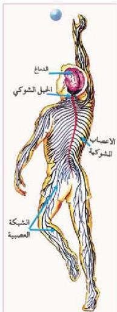

## أجزاء الجهاز العصبي في الإنسان:

انظر الشكل (١٢)، ولاحظ تركيب الجهاز العصبي في الإنسان.

- ما الأجزاء الرئيسية للجهاز؟

- ما أهمية الجهاز العصبي لجسم الإنسان؟

يتركب الجهاز العصبي في جسمك من ثلاثة أجهزة رئيسة مرتبطة ببعضها وهي كالاتي:

### أولاً: الجهاز العصبي المركزي (CNS):

ويتكون من الأعضاء الآتية:

- الدماغ (Brain): ويوجد داخل جمجمة الرأس، ويعتبر أهم الأعضاء في الجهاز العصبي ككل، وأكبرها حجماً، ووزناً. ويبلغ وزن الدماغ في رأس الإنسان البالغ حوالي ١٥٠٠ غرام، بينما يصل عدد خلاياه حوالي ١٠٠ مليار خلية عصبية.

- ما أهمية وجود الدماغ داخل الجمجمة؟

نتيجة لأهمية عضو الدماغ للإنسان، ومن أجل المحافظة عليه من الصدمات والمؤثرات الخارجية

الشكل (١٢) الجهاز العصبي، وتفرعاته في الإنسان.

الأخرى، فقد حمى الخالق عز وجل الدماغ بصندوق الجمجمة التي تتميز عظامها بأنها أشد العظام صلابة في الجسم، إضافة إلى ذلك فقد وجد أن الدماغ محاط بثلاثة أغشية، تسمى الأغشية السحائية (Meninges) زيادة في المحافظة عليه من المؤثرات الخارجية، وهذه الأغشية مرتبة من الخارج إلى الداخل كالاتي:

أ - غشاء الأم الجافية (Duramater) ويتميز بأنه نسيج سميك يتكون من ألياف تبطن عظام الجمجمة من الداخل.

ب - غشاء الأم العنكبوتية (Arachnoid) ويتميز بأنه نسيج شبكي يشبه بيت العنكبوت، ويقوم بعملية الربط بين غشاء الأم الجافية، وغشاء الأم الحنون المحيط بأجزاء الدماغ.

٢٠

الأحياء: النصف الثالث الثانوي

http://E-learning-moe.edu.ye