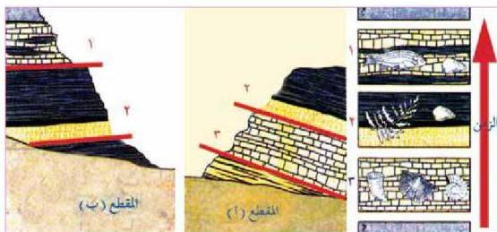

ولكن هل طريقة المضاهاة الصخرية تؤدي دائماً إلى نتائج صحيحة؟
لقد اتضح للعلماء أن فاعلية هذه الطريقة تكون جيدة عند استعمالها في المضاهاة والمقارنة بين قطاعات قريبة من بعضها البعض، أما في حالة استعمالها في المناطق المتباعدة فقد لا تؤدي إلى نتائج صحيحة، لأن الترسيبات غالباً ما تكون مختلفة.
ولهذا فإنه يلزم الاعتماد على نوع آخر من المضاهاة، وهي المضاهاة الزمنية بواسطة الأحافير (المضاهاة الأحفورية).

### ب - المضاهاة الأحفورية (Biocorrelation)

هي عملية مضاهاة أو توافق بين الطبقات في أماكن مختلفة لتحديد أعمارها النسبية بالاعتماد على الأحافير التي تحتويها هذه الطبقات، فكل طبقة أو مجموعة من الطبقات تتميز بأنواع معينة من الأحافير تفيد في التعرف على عمرها وترتيبها بين الطبقات الأخرى. وذلك لأن كل فترة زمنية من التاريخ الجيولوجي تميزت بانتشار أنواع معينة من الكائنات الحية، وبقايا هذه الكائنات أو آثارها في الصخور تدلنا على فترة زمنية واحدة تكونت في أثنائها تلك الصخور، كما عرفنا في مبدأ تعاقب الحياة.

الشكل (٢١) المضاهاة الأحفورية بين مقطعين للحافة بينهما بعيدة

فإذا وجدت هذه الأحافير في طبقات صخرية في منطقتين متباعدتين، فهذا يدلنا على أن هذه الطبقات تكونت في أثناء فترة زمنية واحدة، رغم وجود اختلافات شديدة في صفات الصخور الفيزيائية وتركيبها المعدني المكونة لهذه الطبقات كما تلاحظ بالشكل (٢١).

٢٠٠

الأحياء للصف الثالث الثانوي