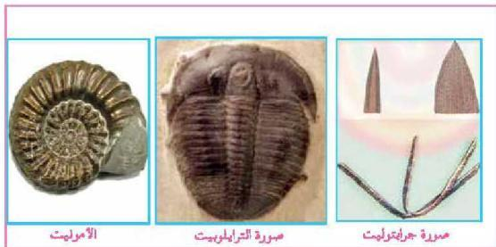
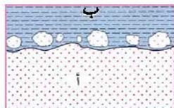

لكن هل تعدّ الأحافير كلها مفيدة لإتمام عملية المضاهة بين الطبقات في الأماكن المتباعدة؟ لقد اتضح من الدراسات أن ثمة أنواعاً من الأحافير يمكن الاعتماد عليها أكثر من غيرها في عملية المضاهة، وتعرف بالأحافير المرشدة أو الدليلية (Index Fossils).

### فما هي الأحفورة المرشدة ؟

الأحفورة المرشدة هي ذات الأمد الزمني القصير (أي ذات العمر الجيولوجي القصير) وبذلك يسهل تحديد الزمن بدقة، وذات الانتشار الجغرافي الواسع، أي إنها كانت واسعة الانتشار جغرافياً وبذلك تسهل عمليات الترابط بين مناطق أو قارات متباعدة. ومن الأمثلة عليها في الشكل (٢٢) : أحفورة الترابلوبيت من نوع متعددة القطع التي ترشدنا إلى عصر الكمبري، وأحفورة جرابتوليت التي ترشدنا إلى العصرين الأوردوفيشي والسيلوري من الحقبة القديمة، وأحفورة الأمونيت التي ترشدنا إلى الحقبة المتوسطة.

الشكل (٢٢)

### ٤- مبدأ الاحتواء :

الجسم الصخري الذي يحتوي على قطع من جسم آخر يعتبر أحدث من الجسم الذي أخذت منه هذه القطع، والشكل (٢٢) يعطينا مثلاً على ذلك فالصخر (ب) أحدث من الصخر (أ)، لأن جزءاً من (أ) محتوى داخل (ب).

الشكل (٢٣) جسم صخري يحتوي قطع من جسم آخر

الأحياء للصف الثالث الثانوي

٢٠١