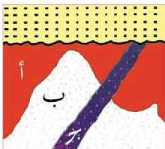
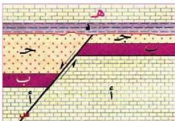

# ●- مبدأ القاطع والمقطوع:

(القاطع أحدث من المقطوع)

إن الجسم الصخري الناري أو المعلم الجيولوجي، مثل القاطع أو الصدع الذي يقطع جسماً أو معلماً آخر، هو أحدث من المقطوع وأقدم من الذي لا يقطعه. انظر الشكل (٢٣) تلاحظ أن الصخر (ج) اندفع خلال الصخر (ب) وكلاهما قطع الصخر (أ).

الشكل (٢٤) القاطع أحدث من المقطوع

ما أقدم الصخور هنا؟ ماذا يسمى الصخر (ج)؟

وفي الشكل (٢٥) تلاحظ تعاقباً صخرياً (أ، ب، ج) تعرض لحركات تكتونية أدت إلى قطعه بالصدع (س)، ثم تعرض التعاقب لعملية التعرية، ومن ثم ترسبت الطبقات (د، هـ) في وضع أفقي فوقه.

الشكل (٢٥) القاطع أحدث من المقطوع

- رتب الأحداث الجيولوجية من الأقدم إلى الأحدث؟

# النشاط (٢)

● نفذ النشاط الخاص باستخدام مبادئ التاريخ النسبي في قراءة التاريخ الجيولوجي لمنطقة ما في كتاب الأنشطة.

# ثانياً- التاريخ المطلق للصخور بواسطة النشاط الإشعاعي:

يستخدم النشاط الإشعاعي في إعطاء أعمار محددة للمعادن والصخور، وهو ما يشار إليه بالأعمار المطلقة (Absolute Ages) فقد لاحظ العالم هنري بكزل في العام ١٨٩٦م، أن بعض المعادن في الصخور تحتوي على عناصر ذات نشاط إشعاعي (Radioactivity) فما هو النشاط الإشعاعي؟ وكيف يمكن حساب أعمار الصخور؟ النشاط الإشعاعي هو انحلال تلقائي لنواة العنصر الكيميائي عن طريق انبعاث

٢٠٢

الأحياء: النصف الثالث الثانوي