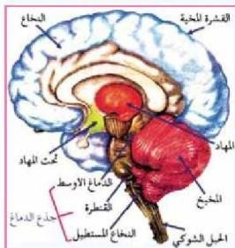

جـ - غشاء الام الحنون ( Pia Mater ) ويتميز بأنه نسيج رقيق يغلف الدماغ بشكل مباشر، ويوجد سائل بين الام العنكبوتية والام الحنون يعمل على الزيادة في امتصاص الصدمات، وقد وجد ان الاغشية السحائية قد تتعرض لبعض الالتهابات الخطيرة، والتي قد تسبب الوفاة للإنسان إذا لم يتم معالجتها بسرعة.

## النقاط (٢)

• قم ومجموعة من زملائك بزيارة إلى أقرب مستشفى أو مركز صحي لجمع المعلومات عن الالتهاب السحائي في منطقتك.

ويتكون الدماغ من الاجزاء الآتية:

أ - المخ ( Cerebrum ) ويشكل الجزء الأكبر من الدماغ؛ حيث يتركب من نسيج مخي مكون من طبقتين هما:

١- الطبقة الخارجية (القشرة)، وهي طبقة رقيقة تحتوي على أجسام الخلايا العصبية واللياف عصبية غير محاطة بأغماد نخاعية بحيث يبدو لونها رمادي، ولهذا تسمى المادة الرمادية Grey Matter.

٢- الطبقة الداخلية (النخاع)، وتتكون من مجموعة من الالياف العصبية المحاطة بأغماد نخاعية بحيث يبدو لونها أبيض؛ ولهذا فإنها تسمى

الشكل (١٣) مقطع طولي بين اجزاء الدماغ.

المادة البيضاء White Matter. الشكل (١٣).

وينقسم الدماغ إلى نصفين متشابهين هما النصف الايمن، والنصف الايسر، وتظهر في كل نصف عدد من الاخاديد، أو الشقوق يمكن بواسطتها تمييز فصوص الدماغ في كل نصف، وهذه الفصوص هي الفص الجبهي (الامامي)، والفص الجداري، والفص الصدغي، والفص الخلفي، وقد وجد ان كل فص يتخصص بوظائف محددة سواء حسية أم حركية، كما اتضح ان المراكز القصية للنصف الايمن تتحكم بالجانب الايسر من الجسم، بينما المراكز القصية للنصف الايسر تتحكم بالجانب الايمن من الجسم.

٢١

الاجزاء للصف الثالث الثانوي

http://E-learning-moe.edu.ye