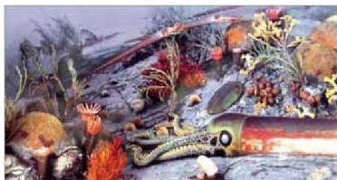
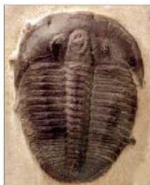

كائنات حية ذات هياكل صلبة أو تفرز مواداً صلبة كالأصداف والترايلوبيت، ومن ثم ظهرت الهياكل العظمية.

تميزت هذه الحقبة بانتشار واسع للكائنات اللافقارية. انظر (الشكل - ٢٨) فظهرت طائفة المرجان الذي استمر انتشاره من الأردوفيشي إلى البرمي بتوعيه الأنبوبي والرباعي، كذلك المفصليات وأشهرها الترايلوبيت والتي تعد من الأحافير المرشدة للعصر الكمبري. انظر الشكل (٢٩) الذي يوضح صورة لأحفورة ترايلوبيت، وقد ظهرت هذه الأحافير في بداية الحقبة وانقرضت في نهايتها (في البرمي).

الشكل (٢٨) بعض أنواع اللافقاريات والقدميات ذات الصدقة المستقيمة والترايلوبيت والمسرجيات والقواقع والمرجان

ثم ظهرت الرخويات، وهي حيوانات محمية بصدفة خارجية، فأول ما ظهرت المسرجيات في نهاية العصر الأردوفيشي، أما البطنقدميات (القواقع)، فقد ظهرت في بداية عصر الكمبري. إلا أن تنوع هذه الكائنات

وانتشارها كان محدوداً جداً في هذه الحقبة، مقارنة بالحقب اللاحقة. كما ظهرت أيضاً الجلدشوكيات (Echinodermata) في العصر الكمبري

الشكل (٢٩) أحفورة ترايلوبيت

الأسفل، وانتشرت بشكل واسع جداً في العصر الكريتاسي، وما زالت تعيش إلى اليوم. أما طائفة الراسقدميات، فقد تميزت بظهور أحافير النوتيلس التي لا تزال أنواع منها تعيش حتى الآن.

# - الحياة الفقارية:

ظهرت في هذه الحقبة عدد من الفقاريات البدائية، وأهمها الأسماك، وأول ما ظهر منها أسماك عديمة الفكوك التي وجدت أحافيرها في صخور العصر الأردوفيشي وانقرضت

٢١٠

الأحياء للصف الثالث الثانوي