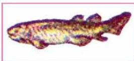
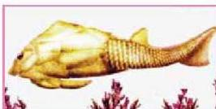
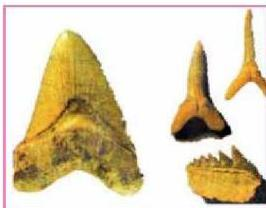
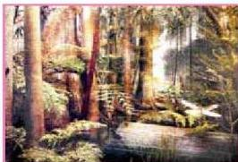

الشكل (٣٠) أحفورة سمكة الاستراكوديرم

الشكل (٣١) سمكة بلاكوديرم الصخرية

الشكل (٣٢) أحافير أسنان أسماك غضرفية

الشكل (٣٣) نباتات لازهرية (وعائية)

في الديفوني وعرفت أحافيرها باسم الاستراكوديرم كما في (الشكل - ٣٠). وفي بداية العصر الديفوني ظهرت وازدهرت الأسماك ذات الفكوك والزعانف المزدوجة (البلاكوديرم)، (الشكل - ٣١) وهي ذات حجوم صغيرة تعيش في المياه العذبة.

أما الأسماك الغضروفية التي ميزت أحافير العصر الكربوني والبرمي، فقد تحفرت أسنانها كما في الشكل (٣٢). وفي أواخر هذه الحقبة ظهرت البرمائيات، أما الزواحف فظهرت في نهاية هذه الحقبة في أواخر العصر الكربوني وبداية البرمي.

# - الحياة النباتية:

في بداية الحقبة اقتصرت الحياة النباتية على الأعشاب البحرية وخاصة الطحالب ذات الهياكل الكلسية مما ساعد على الاحتفاظ بها كحافير، وفي العصر الديفوني بدأ ظهور السرخسيات (نباتات لازهرية) وانتشرت في العصر الكربوني في بيئة المستنقعات وكونت غابات كثيفة من الأشجار الضخمة. انظر (الشكل - ٣٣) والتي نتج عن تراكمها ودقتها الفحم الحجري.

الأحياء للصف الثالث الثانوي

٢١١