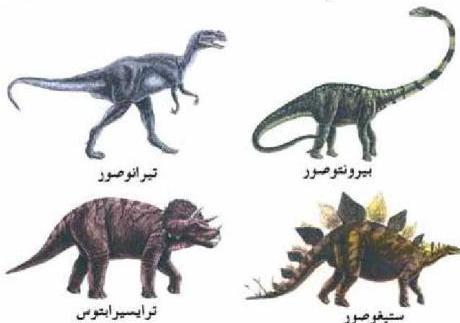

### ٣- حقبة الحياة المتوسطة (Mesozoic Era):

استمرت هذه الحقبة حوالي (١٨٠ مليون سنة) وقسمت إلى ثلاثة عصور رئيسة، وتميزت بالكائنات الحية الأكثر رقياً، والأكثر تنوعاً، فظهرت أنواع جديدة من الرأسقدميات (الأمونيتات) - (والشكل - ٣٤) يوضح أحفورة أمونيت - وقد انقرضت في نهاية الكريتاسي (الطباشيري) وتعتبر من الأحافير المرشدة.

ومن اللافقاريات ظهرت أنواع جديدة من الجوفموميات (المرجان السداسي) والتي سادت في الترياسي واستمرت حتى الوقت الحاضر.

إضافة إلى المحاريات ذات المصراعين التي سادت في الكريتاسي وتكون عنها الصخور الطباشيرية، والقواقع (الحلزونيات) والجلد شركيات مثل قنافذ البحر والتي انتشرت في الكريتاسي.

أما الحياة الفقارية: فقد تميزت بظهور الزواحف، ومنها الشكل (٣٤) أحفورة أمونيت الزواحف العملاقة (الديناصورات) التي سادت في الجوارسي والكريتاسي وهي أنواع متعددة، التي منها في البرآكلة العشب (بيرونتوصور)، وآكلة اللحوم (تيرانوصور)، وفي البحر (أكتيوصور)، وفي الجو التنين الطائر (تيروداكتيل). انظر الشكل (٣٥).

الشكل (٣٥) بعض أنواع الديناصورات

٢١٢

الأحياء للصف الثالث الثانوي