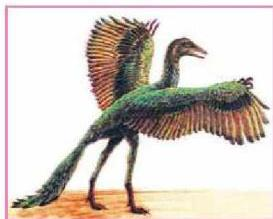

واختفت الزواحف العملاقة قرب نهاية الحقبة، لكثرة الزلازل والبراكين، تاركة المجال للأنواع الصغيرة الحجم من الزواحف التي انتشرت في منتصف هذه الحقبة وأهمها: السلاحف والسحالي والتماسيح والأفاعي والتي بقيت أنواع منها حتى الآن.

الشكل (٣٦) أحفورة أركيوبتركس

أما الطيور فقد عثر على أحفورة الطائر ذي الأسنان (أركيوبتركس) وذلك في العصر الجوارسي الأسفل، ويعد من أوائل الطيور التي ظهرت وكان له أسنان في منفاره، وانقرضت في العصر الكريتاسي الأعلى، ويوضح الشكل (٣٦) أحفورة لهذا الطائر.

وفي نهاية هذه الحقبة ازداد عدد الثدييات في جميع البيئات.

### الحياة النباتية:

تضاءلت النباتات اللازهرية في أوائل الترياسي؛ حيث ظهرت النباتات عاريات البذور كالصنوبر والأرز والتي كونت غابات كثيفة، كذلك ظهرت النباتات مغطاة البذور وخاصة ذوات الفلقة الواحدة، كالغاب والنخيل، في أواخر الكريتاسي.

### ٤- حقبة الحياة الحديثة (Cenozoic):

تمثل هذه الحقبة الفترة الزمنية التي تمتد منذ حوالي (٦٥) مليون سنة حتى الوقت الحالي. وقد تم تقسيمها إلى عصرين: الثلاثي والرباعي، وتعتبر حقبة سيادة الثدييات، وقد بدأت بالحسار البحار واتساع رقعة القارات، وفي بدايتها كان المناخ حاراً جداً ثم أخذ في البرودة حتى صار في أواخرها جليداً في أوروبا وأمريكا الشمالية. انقرضت كثير من الأنواع المميزة لحقبة الحياة الوسطى وظهرت أنواع جديدة كثيرة الشبه بالأنواع المعاصرة، وكذلك سادت النباتات الزهرية مغطاة البذور (Angiosperms) وكونت غابات من ذوات الفلقتين مثل أشجار الحور والزيتون والكافور إلى جانب النخيل.

الأحياء الصيف الثالث الثانوي

٢١٣