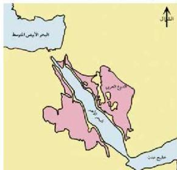
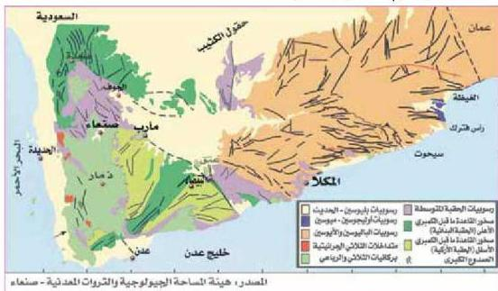

## جيولوجية الجمهورية اليمنية

تقع الجمهورية اليمنية في الجزء الجنوبي من شبه الجزيرة العربية والتي تكون جزءاً من الدرع العربي - النوبي الذي يقع على جانبي أخدود البحر الأحمر، ومن جنوب الأردن حتى اليمن. (شكل ٣٧).

ويتكون الدرع العربي من صخور القاعدة النارية والمتحولة، وترتكز عليه وحدات من الصخور الرسوبية بتراوح عمرها ما بين الأردوفيشي والحديث، إلا أن أكثرها انتشاراً وتمثيلاً هي رواسب العصر الجوارسي ورواسب العصر الكريتاسي (الطباشيري) ورواسب العصر الثلاثي والرباعي في المناطق الشرقية والشمالية الشرقية.

الشكل (٣٧) خريطة تبين امتداد الدرع العربي

انظر الخريطة الجيولوجية للجمهورية اليمنية، الموضحة بالشكل (٣٨)، ولأحظ أعمار الصخور التي تشير إليها الألوان المختلفة، فماذا ترى؟

الشكل (٣٨) الخريطة الجيولوجية للجمهورية اليمنية

٢١٤

الأحياء: النصف الثالث الثانوي