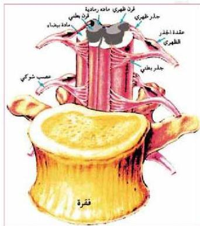

- ما الجانب من الجسم الذي يصاب بالشلل عند حصول مشكلة للنصف الأيمن من الدماغ؟
ب - الخيخ (Cerebellum) : ويشكل الجزء الخلفي للدماغ؛ حيث يقع أسفل الفص الخلفي للمخ - الشكل (١٣)، ووظيفته تنظيم الحركات الإرادية للجسم والحفاظة على أترانها؛ مثل: المشي، وحركات اليدين، وغير ذلك.

- ما الذي يحدث لحركات الإنسان عند حدوث مشكلة للمخيخ؟

ج- النخاع المستطيل، أو ساق الدماغ (Brain Stem)، ويربط بين الخيخ والحبل الشوكي في العمود الفقاري الشكل (١٣)، ويقوم بتنظيم الحركات الإرادية لبعض أعضاء النصف العلوي من الجسم؛ حيث يوجد به مراكز التنفس، والقلب، والبلع، والسعال، والعطس.

الحبل الشوكي (Spinal Cord) : ويمتد من النخاع المستطيل داخل العمود الفقاري مشكلاً امتداداً للدماغ؛ حيث تحيط به نفس الأغشية السحائية التي تحيط بالدماغ.

- ما الأغشية السحائية التي تحيط بالنخاع الشوكي؟

يتركب نسيج الحبل الشوكي من طبقتين هما الطبقة الخارجية متكونة من المادة البيضاء، والطبقة الداخلية متكونة من المادة الرمادية. الشكل (١٤).

الشكل (١٤) مقطع في الحبل الشوكي يوضح اتصال الأعصاب الشوكية.

- ما الفرق بين المادة الرمادية، والمادة البيضاء؟

- قارن بين نوع النسيج في الطبقة الخارجية، والطبقة الداخلية في كل من الدماغ، والحبل الشوكي.

ويخرج من جانبي الحبل الشوكي (٣١) زوجاً من الأعصاب الشوكية يتصل كل عصب بالحبل الشوكي بجذرين: أحدهما ظهري يحتوي على الألياف والخلايا العصبية الحسية، والجذر الآخر

٢٢

الأحياء: النصف الثالث الثانوي

http://E-learning-moe.edu.ye