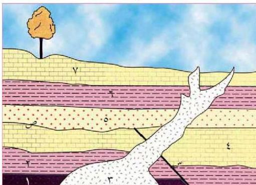

## رابعاً: علام نستدل من المشاهدات الجيولوجية الآتية:

١- وجود سطح غير مستو بين مجموعتين من الطبقات؟
٢- وجود أحافير الأمونيت في طبقة صخرية؟
٣- وجود أحافير الترابلوبيت في طبقة صخرية؟
٤- وجود طبقات سمكية متعاقبة؟
٥- وجود طبقات رقيقة متعاقبة؟

## خامساً:

الشكل التالي يمثل مقطعاً لتعاقب صخري رسوبي اخترقته ماجما بردت وتبلورت لتكون جسماً نارياً جوفياً.
- ادرس الشكل وأجب عن الأسئلة التي تليه:

١- ما الصخران الأقدم والأحدث في هذا المقطع؟
٢- أيهما أحدث: سطح عدم التوافق (ص) أم الصدع (س)؟
٣- أيهما أقدم: الطبقة (هـ) أم الصدع (س)؟
٤- رتب الصخور والمعالم الجيولوجية من الأقدم إلى الأحدث؟

٢٢٢

الأحياء للصف الثالث الثانوي