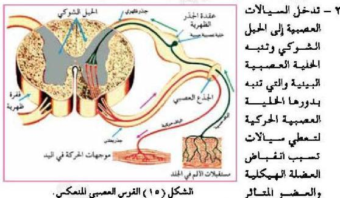

بطني يحتوي على ألياف الخلايا العصبية الحركية، يندمج الجدران ليكونا العصب الشوكي الذي يتكون من نوعين من الألياف العصبية الحسية والحركية، لهذا تسمى الأعصاب المختلطة، حيث تقوم بنقل السبالات العصبية الحسية والحركية بين أجزاء الجسم والحبل الشوكي في حركة دائمة تسمى رد الفعل العصبي المنعكس .

### رد الفعل العصبي المنعكس Reflex Action

يتم الإحساس بالمؤثرات الخارجية وحدوث الإستجابة المناسبة لها في عملية مستمرة تسمى رد الفعل العصبي المنعكس، يمثل رد الفعل العصبي استجابة غير إرادية تلقائية للتغيرات الحادثة داخل الجسم أو خارجه، ويتدخل الدماغ في عمل بعض الأفعال المنعكسة كرمش العين عند اقتراب جسم منها، بينما لا يتدخل في بعضها الآخر كسحب اليد بسرعة عند ملامستها فجأة جسماً ساخناً، حيث يقوم بذلك الحبل الشوكي وفقاً لما يلي:

١ - يؤدي تنبيه النهايات العصبية (مستقبلات الألم في الجلد) بواسطة الحرارة إلى تكوين سيالات عصبية تنتقل عبر الخلية العصبية الحسية.

الشكل (١٥) القوس العصبي المنعكس.

٢ - تدخل السبالات العصبية إلى الحبل الشوكي وتنبه الخلية العصبية البينية والتي تنبه بدورها الخلية العصبية الحركية لتعطي سيالات تسبب انقباض العضلة الهيكلية والعضو المتأثر
مسببة سحب اليد بعيداً عن الجسم الساخن .
من خلال ملاحظاتك للشكل (١٥) ما الأجزاء التي يتألف منها القوس العصبي المنعكس ؟.

الأحياء للصف الثالث الثانوي

٢٣

http://E-learning-moe.edu.ye