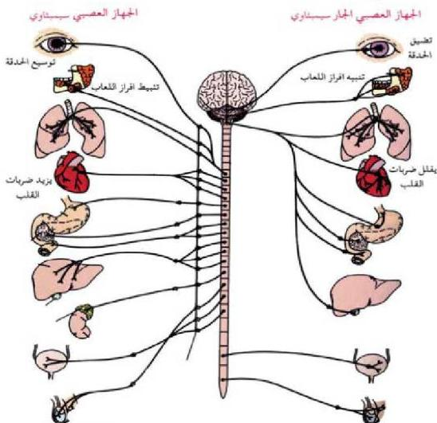

٢- الجهاز العصبي الجارسمبثاوي: ويعمل عكس الجهاز السمبثاوي، أي أنه يقوم مثلاً بتقليل ضربات القلب، أو ضغط الدم، أو تضييق حدة العين، أو تنبيه إفراز اللعاب، أو تضييق الشُعُوب الهوائية في الرئتين وغير ذلك من الأنشطة اللاإرادية في الجسم.

- اذكر بعض الأمثلة الأخرى لوظائف الجهاز العصبي السمبثاوي؟
- اذكر بعض الأمثلة الأخرى لوظائف الجهاز العصبي الجارسمبثاوي؟

الشكل (١٦) الجهاز العصبي الذاتي.

# النشاط (٤)

• نفذ النشاط الخاص بتشريح ضفدع، والتعرف على أجزاء الجهاز العصبي.

الأحياء للصف الثالث الثانوي

٢٥

http://E-learning-moe.edu.ye