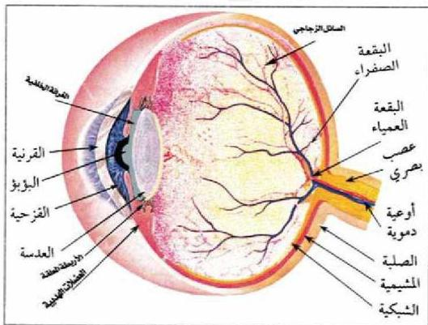

## أعضاء الحس Sense Organs

يتفاعل الإنسان مع البيئة المحيطة به، ويتأثر بمؤثراتها المختلفة كالصوت، والضوء، والحرارة، والرائحة، ويستقبل هذه المؤثرات عن طريق تراكيب تسمى المستقبلات الحسية Sensory Receptors التي توجد في أعضاء الحس Sense Organs والمستقبلات الحسية متنوعة، منها: المستقبلات الضوئية، والكيميائية، والآلية.

### أولاً: المستقبلات الضوئية : Photoreceptors

تحتوي العين على مستقبلات ضوئية تعمل على امتصاص الطاقة الضوئية للجسم المرئي وتكون له صورة على شبكة العين، وتنتقل منها على هيئة سيالات عصبية بواسطة العصب البصري إلى مركز الإبصار حيث يتم ترجمتها وإدراكها.

#### ● تركيب العين :

العين هي عضو الإبصار في الحيوانات الفقارية، ومنها الإنسان وتتكون العين في الإنسان من المقلة، والعضلات المحركة لها.

ادرس الشكل (١٧) الذي يمثل تركيب العين.

– ما الطبقات المكونة للعين؟

الشكل (١٧) تركيب عين الإنسان.

٢٦

الأحياء للصف الثالث الثانوي

http://E-learning-moe.edu.ye