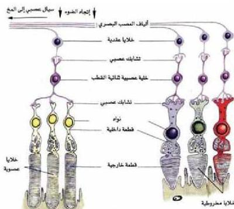

١- الخلايا العصبية: تتركز على الحواف الخارجية للشبكية، وهي حساسة للضوء الخافت، لذا فهي المسؤولة عن الرؤية الليلية Night Vision، ولكنها لا تستطيع تمييز الألوان بسهولة، ويبلغ عددها حوالي مائة مليون خلية في كل عين.
٢- الخلايا المخروطية: تتركز في المنطقة المركزية من الشبكية وتعمل في الضوء الساطع، مثل ضوء الشمس، لذا فهي مسؤولة عن الرؤية الحادة، والرؤية النهارية Day Vision وهي حساسة للألوان؛ حيث تستطيع التمييز بين الألوان المختلفة. ويبلغ عدد الخلايا المخروطية حوالي خمسة ملايين خلية في كل عين.
- كيف تفسر وضوح الرؤية في الضوء الساطع؟

الشكل (١٨) الخلايا المخروطية والعصبية في العين.

ادرس الشكل (١٨) لاحظ كيف تتصل الخلية العصبية الواحدة ثنائية القطب بعدد من الخلايا العصبية. أما الخلايا المخروطية فكل خلية منها تتصل بخلية واحدة من ثنائية القطب، وهذا ما يفسر وضوح الرؤية في الضوء الساطع.

### آلية الإحساس بالرؤية : Vision Sensation

إن صورة المراثيات تقع على المستقبلات الضوئية الموجودة في الشبكية، والمتصلة في الخلايا العصبية، والمخروطية، والتي تتأثر بالمؤثر الضوئي، وتحوله إلى سيالات عصبية ترسله إلى مراكز الإبصار في الدماغ ليتم إدراكها.
- كيف تتأثر الخلايا العصبية، والمخروطية بالضوء؟
- كيف يتحول ذلك التأثير إلى سيالات عصبية؟

٢٨

الأحياء: للصف الثالث الثانوي

http://E-learning-moe.edu.ye