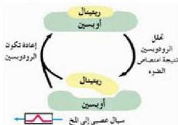

تحتوي الخلايا العصبية على صبغة الرودوسين Rhodopsin الحساسة للضوء مما يمكنها من الاستجابة للضوء بسهولة، وإن كان خافتاً، فعندما تسقط الموجات الضوئية على هذه الصبغة فإنه يتحول إلى صورة أقل تماسكاً مما يسبب تفككه إلى نواتج كيميائية مختلفة تسمى ريتينال وأوبسين، وتسبب هذه التحللات الكيميائية المتعاقبة تغيرات في فرق الجهد الكهربائي لخشاء الخلايا العصبية مما يسبب نشوء جهد فعل يسري على هيئة

الشكل (١٩) آلية الرؤية في العين

سيالات عصبية تنقل عبر العصب البصري إلى الدماغ. وعادة يتم إعادة صبغ الرودوسين بسرعة من نواتج التحلل السابقة حيث يكون قادراً على استقبال موجات ضوئية جديدة. شكل (١٩). وتستمر عملية تحلل الصبغ، وإعادة مرة أخرى ما دامت عملية الإبصار مستمرة. ويعد الصبغ الشبكي Retinal

أحد مكونات الرودوسين الأساسية، ويمكن الحصول عليه في الجسم من فيتامين (A).
- كيف يمكن التمييز بين الألوان المختلفة؟

تحتوي الخلايا المخروطية على صبغات بصرية خاصة (البودوسين Iodopsin) تعمل بصورة مشابهة لطريقة عمل الرودوسين في الخلايا العصبية، وتستطيع التمييز بين الأطوال المختلفة للأمواج الضوئية مما يسهل عملية تمييز الألوان، ورؤية تفاصيل الأشياء، وهي تكثر في البقعة الصفراء من الشبكية، كما أن شدة تأثير البودوسين بالأطوال الموجية المختلفة يتبعه اختلافات في السيالات العصبية الصادرة من كل منها، ويستطيع الدماغ تحليل السيالات العصبية المختلفة، ومنها يتعرف على ألوان الطيف الضوئي (المرئي) التي من خلالها يتم إدراك ألوان صورة الجسم المرئي وأي خلل وراثي في الخلايا المخروطية قد ينتج عنه عدم القدرة على تمييز الألوان فيكون الشخص مصاباً بمرض عمى الألوان.

■ اكتب تقريراً عن مرض عمى الألوان.

قضية البحث

الأحياء الصف الثالث الثانوي

٢٩

http://E-learning-moe.edu.ye