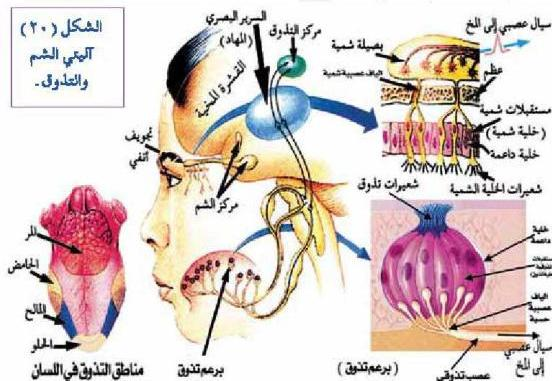

## ثانياً: المستقبلات الكيميائية Chemoreceptors

توجد هذه المستقبلات في الأنف، ووظيفتها التعرف على الروائح المختلفة، وكذلك توجد على سطح اللسان لمعرفة المداخلات المختلفة للأطعمة التي نأكلها، وتتأثر هذه المستقبلات بالمواد الكيميائية. والمستقبلات الكيميائية في جسم الإنسان نوعان هما:

### ١- مستقبلات الشم Olfactory Receptors

– أين توجد مستقبلات الشم؟

أدرس الشكل (٢٠) ولأحظ كيف تتكون خلايا الشم من عصبونات حسية متحورة، تسمى الخلايا الشمية التي تتشابك مع ألياف عصبية لتكون العصب الشمي، وتحيط بالخلايا الشمية خلايا داعمة وخلايا مفردة للمخاط، ويوجد في نهاية كل خلية شمية أهداف تقع عليها مستقبلات المواد الكيميائية المختلفة.

### آلية الشم Smell Sensation

– هل تساءلت كيف يمكنك شم الروائح المختلفة والتمييز بينها.
تتم عملية الشم للروائح وفق الخطوات الآتية:

٣٠

الأحياء: النصف الثالث الثانوي

http://E-learning-moe.edu.ye