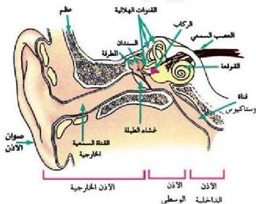

## العلاقة بين حاسة الشم، وحاسة التذوق:

- لماذا يقل إحساسك بالشم، وتفقد جزءاً كبيراً من القدرة على التذوق عندما تصاب بالزكام؟
- عندما تقرب برتقالة من أنفك تميز رائحة البرتقالة وطعمها. كيف يحدث ذلك؟
- تنتقل الغازات الطيارة من ثمرة البرتقال مع هواء الشهيق إلى داخل الأنف، وتذوب في المخاط بما يساعدك على تمييز الرائحة، وفي نفس الوقت تصل هذه الغازات إلى الفم عن طريق البلعوم حيث تذوب في اللعاب وبالتالي تؤثر على براعم التذوق فتشعر بطعم البرتقال، وعليه فهناك علاقة وطيدة بين الإحساس بالشم والتذوق، فكل منهما يقوي الآخر.
- لماذا تشعر بمذاق الطعام الساخن أكثر من الطعام البارد عند شمه؟

## ثالثاً: المستقبلات الآلية Mechanoreceptors

### أ: مستقبلات الصوت والتوازن Hearing and Balance Receptors

- كيف ينتقل الصوت في الهواء؟

توجد مستقبلات الصوت، والتوازن في الأذنين. ومستقبلات الصوت تتأثر بالموجات الصوتية الناتجة من المنبه الصوتي (منبه آلي)؛ إذ يقوم المستقبل الصوتي بتحويل طاقة الصوت الآلية إلى طاقة كهروكيميائية على هيئة جهد فعل يسري بشكل سيال عصبي في أنابيب العصب السمعي التوازني إلى مركز السمع في الدماغ؛ حيث يتم ترجمته وإدراكه.

### تركيب الأذن في الإنسان:

ادرس الشكل (٢١)، وتعرف على أجزاء الأذن ومحتوياتها.

- ما أسماء الأجزاء الرئيسية الثلاثة التي تتركب منها الأذن؟

- ما وظيفة كل جزء منها؟
- ما مكونات كل من الأذن الوسطى والأذن الداخلية؟

الشكل (٢١) تركيب أذن الإنسان

٣٢

الأحياء: النصف الثالث الثانوي

http://E-learning-moe.edu.ye