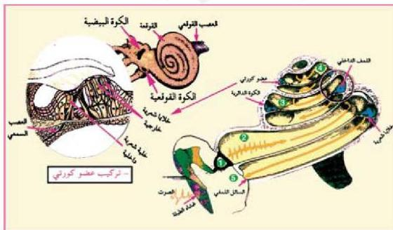

لاحظ أن الأذن تتكون من :

١- الأذن الخارجية التي تتكون من صوان الأذن، والقناة السمعية والطبلية، كما تحتوي الأذن الخارجية على عدد تفرز مادة شمعية لحماية الأذن الوسطى.

٢- الأذن الوسطى :

عبارة عن تجويف يقع خلف الطبلية، ويتصل بتجويف البلعوم بواسطة قناة استاكيوس المسؤولة عن تعادل الضغط الجوي على جانبي غشاء الطبلية، وتوجد في الأذن الوسطى ثلاث عظيمات سمعية. ما هي؟

٣- الأذن الداخلية : عبارة عن تجويف مملوء بسائل شفاف تؤدي حركته إلى تنبيه مستقبلات الصوت، أو التوازن. تتكون من :

- القوقعة Cochlea التي تحتوي على مستقبلات الصوت، وتتكون هذه المستقبلات من خلايا شعرية كما يوجد بها عضو كورني.

- القنوات الهلالية (Semicircular Canals) التي تحتوي على مستقبلات التوازن.

# آلية السمع :

- كيف يسمع الإنسان الأصوات ويميزها؟

تقوم الأذن الخارجية بتجميع الأمواج الصوتية بواسطة صوان الأذن، ومن ثم نقلها عبر القناة السمعية إلى الطبلية، فتهتز الطبلية. شكل (٢٢).

الشكل (٢٢) قطاع في القوقعة.

الأحياء للصف الثالث الثانوي

٣٣

http://E-learning-moe.edu.ye