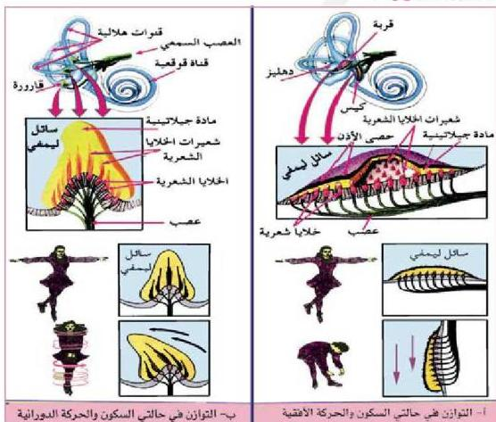

– لماذا تقل قدرة الإنسان على السمع عندما تتمزق الطبلة؟
يؤدي اهتزاز الطبلة إلى تحريك العظيمة الثلاث الموجودة في الأذن الوسطى
(المطرقة – السندان – الركاب).

تنتقل الاهتزازات من عظمة الركاب إلى السائل الموجود في القوقعة بالأذن
الداخلية عبر الكرة البيضاء.

تؤثر اهتزازات السائل في القوقعة على مستقبلات الصوت الموجودة في خلايا
السمع، وتقوم بتحويله إلى سيالات عصبية.

تنتقل السيالات العصبية من خلايا السمع إلى الأعصاب القوقعة التي تكون
العصب السمعي وتتجه مع عصب السمع التوازني إلى مركز السمع بالدماغ.

يقوم مركز السمع بتحويل الإشارات العصبية إلى أصوات يسهل على الإنسان
إدراكها وتمييزها. شكل (٢٣).

# مستقبلات التوازن :

الشكل (٢٣) مستقبلات التوازن في القرية والكيس والقارورة

٣٤

الأحياء للصف الثالث الثانوي

http://E-learning-moe.edu.ye