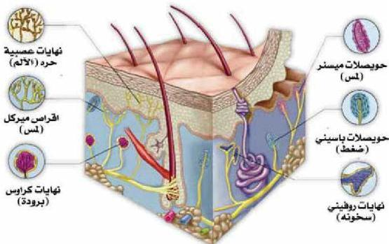

الشكل (٢٤) المستقبلات الحسية في الجلد.

تتكون طبقة الأدمة في الجلد من نسيج ضام وتحتوي على أوعية دموية، وبصيلات شعرية وغدد عرقية، ودهنية، وأعصاب حسية تحوي مستقبلات الأحاسيس العامة، وهي متعددة الأشكال والأحجام، والوظائف. ومن المستقبلات الآلية الآتي :

١- مستقبلات اللمس : Touch Receptors

وتسمى حويصلات ميسنر Meissner's Corpuscles، وهي بيضاوية الشكل، وتحتوي كل حويصلة على ليفة عصبية حسية تنتهي أفرعها بأزرار حسية صغيرة، تقوم بوظيفة الإحساس باللمس وكذلك أقراص ميركل تقوم بنفس الوظيفة.

٢- مستقبلات الحرارة : Heat Receptors وهي منتشرة في الجلد، وتتأثر بالتغيرات الحرارية لسطح الجلد، ومن مستقبلات الحرارة نهايات روفيني للسخونة

■ اكتب بحثاً عن أحد أمراض أعضاء الحس في منطقتك وطرق الوقاية من هذا المرض، مستعيناً بالمراجع الموجودة في مكتبة مدرستك.

قضية البحث

٣٦

الأحياء للصف الثالث الثانوي

http://E-learning-moe.edu.ye