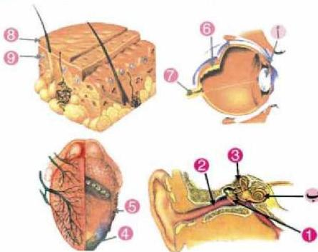
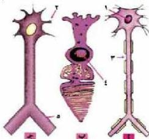

٧- ادرس الاشكال الآتية التي تمثل أعضاء الحس، ثم أجب عن الاسئلة التي تليها:

- اكتب أسماء الاجزاء المشار إليها بالأرقام (9.8.7.6.5.4.3.2.1)
- ما وظيفة الجزء المشار إليه بالرمز (أ).
- ما العملية التي تحدث في الجزء المشار إليه بالرمز (ب).

٨- الشكل المجاور يوضح ثلاث خلايا عصبية في الإنسان حسب وظيفتها والمطلوب الآتي:

- اذكر اسم كل من الخلايا (أ، ب، ج).
- حدد اتجاه السيل العصبي مستخدماً رموز الخلايا العصبية.
- سمّ الاجزاء المرقمة من (١) إلى (٥).

٩- ارسم مع كتابة البيانات كلاً من:

- الاجزاء المختلفة للعين.
- مقطع طولي يبين اجزاء الدماغ.
- الخلية العصبية في الإنسان.

الأحياء للصف الثالث الثانوي

٣٩

http://E-learning-moe.edu.ye