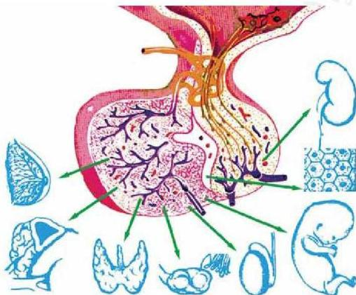

# التنظيم الهرموني
Hormonal Regulation

# الوحدة الثانية

# أهداف الوحدة

يتوقع منك بعد دراستك لهذه الوحدة أن تكون قادراً على أن:

١- تُعرّف مفهوم الهرمون، والتنظيم الهرموني في الكائنات الحية.
٢- توضح دور بعض الهرمونات في العمليات الحيوية للبيئات.
٣- تصف بعض الهرمونات التي تفرز من الغدد الصماء في جسم الإنسان.
٤- توضح دور التنظيم الهرموني في تنسيق عمل أجهزة الجسم.
٥- تصف بعض الحالات المرضية الناتجة عن الاضطرابات الهرمونية.

٤٠

الأحياء: النصف الثالث الثانوي

http://E-learning-moe.edu.ye