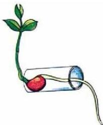
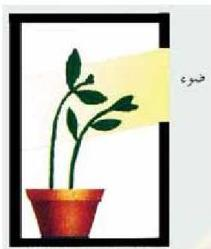

الشكل (١) الإنتحاح الأرضي.

الشكل (٢) الإنتحاح الضوئي.

الجانب السفلي يشبه استطالة الخلايا في هذا الجانب، وينشط استطالتها في الجانب العلوي فينحني الجذر إلى أسفل داخل التربة؛ فالجذر موجب الانتحاح الأرضي - شكل (١). وتنسب الساق إلى أعلى نتيجة لتركيز الأوكسينات في الجانب السفلي، الذي يؤدي إلى استطالة الخلايا في هذا الجانب، مقارنة مع الجانب العلوي، فينحني الساق أثناء نموه إلى أعلى عكس الجاذبية الأرضية مما يجعل الساق سالب الانتحاح الأرضي.
- كيف تفسر الانتحاح الأرضي في النبات؟

## ٢- الانتحاح الضوئي : Phototropism

- ما دور الأوكسينات في عملية الانتحاح الضوئي؟

ادرس الشكل (٢)، ماذا تلاحظ؟

عند وضع أي نبات زينة على نافذة المنزل، تلاحظ أن أجزاء النبات تنحني نحو الضوء نتيجة استجابة النبات للضوء بسبب تأثير الأوكسينات.

- كيف تتحرك أجزاء النبات نحو الضوء؟

تتميز الأوكسينات بقدرة حساسيتها للضوء، فعندما تتعرض ساق النبات للضوء من جانب واحد، تتركز الأوكسينات في الجانب البعيد عن الضوء، وتعمل على استطالة الخلايا في ذلك الجانب بمعدل أعلى من الجانب الآخر فينحني النبات نحو الضوء.

## النشاط (٣)

• نفذ النشاط الخاص بالانتحاح الضوئي الموجود في كتاب الأنشطة والتجارب.

وقد توصل العلماء إلى أن بالإمكان استخدام الهرمونات النباتية في عملية تطوير الإنتاج الزراعي والنباتي لما فيه مصلحة الإنسان والبيئة.

٤٤

الأحياء للصف الثالث الثانوي

http://E-learning-moe.edu.ye