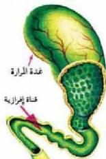

## تطبيقات عملية الهرمونات النباتية

- كيف يستفاد من الهرمونات النباتية في تحديث المجالات الزراعية؟
- أدت الهرمونات النباتية دوراً كبيراً في التطبيقات العملية الزراعية فقد أدخلت في:
  - تكوين الجذور العرضية: تستخدم الأوكسينات في عملية التكاثر الخضري، بواسطة المقل لتكوين الجذور العرضية، ويعمل بهذه الطريقة حالياً في المشاتل، والحدائق.
  - تكوين ثمار بدون بذور: تستخدم الأوكسينات في رش الأزهار غير الملقحة لإنتاج ثمار عديمة البذور كما في البطيخ، والتفاح، وغيرها.
  - تكوين الأزهار: تستخدم الجبريليينات في تنشيط تكوين الأزهار في بعض النباتات.
  - منع تساقط الثمار والأوراق: استخدمت الأوكسينات في تأخير عملية تساقط الأوراق، والثمار قبل نضوجها، وقد تم تطبيق هذه العملية والاستفادة منها في تأخير سقوط أوراق وثمار التفاح، والطماطم، والكمثرى، والمانجو، وبعض الحمضيات.
  - إبادة الأعشاب الضارة: تستخدم بعض أنواع الأوكسينات في رش الحشائش الضارة فتقضي عليها، وتمنع نموها من جديد.

### النشاط (٣)

• نفذ النشاط الخاص بتأثير الأوكسينات على تكوين الجذور العرضية في النبات.

### التنظيم الهرموني في الحيوان

تعمل الهرمونات مع الجهاز العصبي في معظم الحيوانات على تنظيم العمليات الحيوية داخل أجسامها. فالهرمونات مثلاً تنشط النمو والتكاثر اللاجنسي في الهيدرا، وتمتلك مقصليات الأرجل جهازاً هرمونياً يؤدي دوراً مهماً في عملية النمو، والتكاثر والانسلاخ.

أما في الحيوانات الفقارية فإن الهرمونات تفرز من أعضاء تسمى الغدد Glands، والغدة عبارة عن مجموعة من الخلايا الطلائية المتحورة للقيام بوظيفة إفرازية. وتقسم الغدد من حيث وجود القنوات إلى:

١- غدد قنوية Exocrine Glands (غدد الأفراز الخارجي)
انظر الشكل (٣) ولاحظ أن الغدة تصب إفرازاتها إلى الخارج عن طريق قنوات، ومن أمثلة هذا النوع من الغدد: الغدد اللعابية، والغدد اللبينية، والغدد العرقية، والمرارة.

الشكل (٣) غدة قنوية.

٤٥

الأحياء للصف الثالث الثانوي

http://E-learning-moe.edu.ye