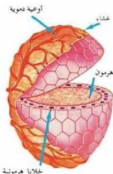

الشكل (٤) غدة صماء.

٢- غدد لا قترية (صماء): Endocrine Glands
(غدد الإفراز الداخلي): وهي عبارة عن غدد صماء تفرز هرمونات، وتصب إفرازاتها في الدم مباشرة مثل: الغدة الدرقية، والغدة النخامية. الشكل (٤).

وتتميز الغدة الصماء بخلايا طلابية غزيرة الإفراز، وغنية بالأوعية الدموية، وتتميز هرموناتها بالقدرة على الانتشار بسرعة في الأنسجة محدثة فعلاً سريعاً، كما أنها تفرز في ظروف معينة لتأدية وظيفة خاصة، لذا يتخلص منها جسم الحيوان بسرعة، إما بتحليلها إلى مركبات بسيطة، أو بإخراجها إلى خارج الجسم. ولجميع الفقاريات

غدد صماء مثل: النخامية، والدرقية، والكظرية، والمناسل. ولذا فإن الفقاريات تمتاز بجهاز هرموني متكامل يعمل على تنظيم وظائف الجسم وعملياته المختلفة.

## التنظيم الهرموني في الإنسان Hormonal Regulation

عرفت دور الرسائل العصبية في تنسيق الوظائف، والعمليات المختلفة في جسمك، ولكن هناك عمليات لا يتم حدوثها بدون وجود الهرمونات المنظمة لذلك.
- ما الفرق بين التنظيم العصبي والتنظيم الهرموني؟

تنقل الرسائل العصبية بواسطة السبالات العصبية، داخل الجهاز العصبي لتقوم بعملية التنظيم، بينما تنقل الرسائل الكيميائية الهرمونية بواسطة الدم إلى أماكن تأثيرها. وتتميز الرسائل الكيميائية الهرمونية بتأثير واسع النطاق، ومفعول طويل المدى في تنظيم العمليات داخل جسم الإنسان.

- ما أهمية التنظيم الهرموني للإنسان؟

تسهم الهرمونات في المحافظة على اتزان البيئة الداخلية للجسم، وفي تنظيم عمليات النمو، والتكاثر، وإنتاج الطاقة، وتخزينها، واستخدامها عند الحاجة، كما تؤثر الهرمونات في سلوك الفرد وتفاعلاته مع الآخرين من حوله.

- هل يوجد تنسيق بين عمل التنظيم الهرموني والتنظيم العصبي في جسم الإنسان؟

إن التنظيمين: الهرموني، والعصبي، يعملان بصورة متكاملة لوجود علاقة تركيبية

٤٦

الأحياء: النصف الثالث الثانوي

http://E-learning-moe.edu.ye