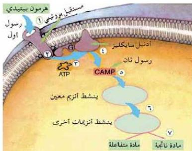
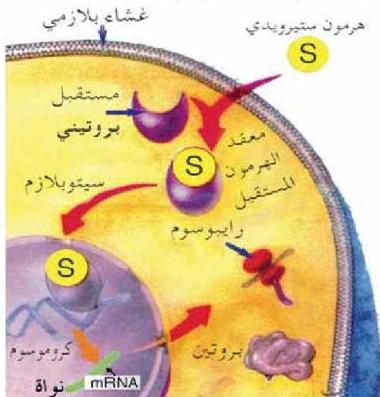

الشكل ١٥ - آلية عمل الهرمونات الببتيدية

الشكل (٥-ب) آلية عمل الهرمونات الستيرويدية.

مثال: يؤدي هرمون الستيرويديون الذي يفرز من الخصية إلى تحفيز الجين الخاص ببناء بروتين العضلات التي تعتبر من الصفات الجنسية الثانوية في مرحلة سن البلوغ.

الفوسفات ATP إلى الأدينوسين أحادي الفوسفات الحلقي Cyclic AMP (الرسول الثاني)، والذي يؤدي إلى استجابة الخلية المستهدفة للهرمون.

ب- آلية عمل الهرمونات الستيرويدية:

عند وصول الهرمون الستيرويدي إلى الخلية الهدف ينفذ إلى داخلها، ويرتبط مع جزئيات المستقبل في السيتوبلازم مكوناً مركباً معقداً من الهرمون ومستقبله، فيدخل هذا المركب إلى نواة الخلية، فيحفز جيناً معيناً مؤدياً إلى بناء بروتينات، كما في الشكل (٥-ب).

٤٨

الأحياء للصف الثالث الثانوي

http://E-learning-moe.edu.ye