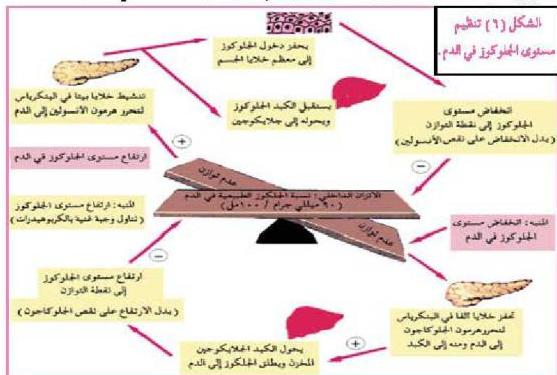

**تنظيم مستوى الجلوكوز في الدم:** من أكثر الأمثلة وضوحاً على تنظيم الهرمونات لأنشطة الجسم وعملياته هرمونات تنظيم مستوى الجلوكوز في الدم. وحتى تدرك هذا الدور أدرس الشكل (٦) ثم أجب عن الأسئلة التي تليه.

- متى يفرز هرمون الأنسولين؟
- متى يفرز هرمون الجلوكاجون؟
- كيف يعمل الأنسولين على خفض تركيز جلوكوز الدم؟
- ما الخلايا الهدف لهرمون الجلوكاجون؟
يصاب الإنسان بمرض السكر إذا ما تلفت خلايا B التي تفرز هرمون الأنسولين في البنكرياس، ويعالج بحقن المريض بالأنسولين. وقد يحدث المرض نتيجة نقص مستقبلات الأنسولين على الخلايا رغم توافر هرمون الأنسولين في الدم.
كما أن البيئة الداخلية للجسم هي المسؤولة عن المحافظة على مكونات الجسم من سوائل ومواد وأيونات في حدود النسب المحددة لها بثبات.

- ابحث في أسباب انتشار مرض السكر في منطقتك.
- اقترح وسائل ومعالجات للمحافظة على صحة الإنسان من الإصابة بمرض السكر.

**قضية البحث**

٤٩

الأحياء للصف الثالث الثانوي

http://E-learning-moe.edu.ye