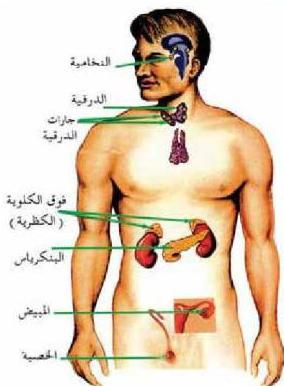

## هرمونات الغدد الصماء في الإنسان:

– أين تقع الغدد الصماء في جسم الإنسان؟

أدرس الشكل (٧)، والجدول (٢) لتتعرف على مواقع الغدد الصماء في جسم الإنسان. ستجد أنها منتشرة في الجسم، وهي إما تكون غداً كاملة مثل: الغدة الدرقية، والنخامية، أو نسيجاً متخصصاً في عضو من الأعضاء، كما في المعدة والأمعاء، أو نسيج متخصص في غدة ذات إفراز خارجي (قنوبية) كما هو الحال في البنكرياس. التي تُعد غدة ذات إفراز خارجي، وغدة صماء في نفس الوقت.

الشكل (٧) الغدد الصماء في جسم الإنسان.

جدول (٢) موقع الغدد الصماء في جسم الإنسان

|  اسم الغدة الصماء | موقعها في الجسم  |
| --- | --- |
|  – الغدة النخامية. | أسفل الدماغ في قاع الجمجمة.  |
|  – الغدة الدرقية. | على السطح الأمامي للقصبة الهوائية أسفل الحنجرة.  |
|  – غدد الجاردرقية. | على السطح الخلفي للغدة الدرقية.  |
|  – الغدتان الكظريتان. | غدة فوق كل كلية.  |
|  – جزر لألجر هانز. | في البنكرياس.  |
|  – غدد القناة الهضمية الصماء. | أنسجة متخصصة في كل من المعدة والأمعاء.  |
|  – الغدد التناسلية. | في خصبة الذكر، وفي مبيض الأنثى.  |
|  – المشيمة. | داخل الرحم في أثناء الحمل.  |

ولكل نوع من هذه الغدد إفراز هرموني متخصص كما يأتي:

٥٠

الأحياء: للصف الثالث الثانوي

http://E-learning-moe.edu.ye