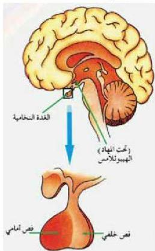

## ١- الغدة النخامية : Pituitary Gland

ادرس الشكل (٨)، والجدول (٣)، واجب عما يأتي:

الشكل (٨) الغدة النخامية.

- أين تقع الغدة النخامية ؟
- ما تتكون الغدة النخامية ؟
- ما الهرمونات التي تفرزها ؟
- اذكر وظيفة كل هرمون ؟
- لماذا تسيطر الغدة النخامية على عمل معظم غدد الجسم الصماء ؟
ومن المهم معرفة أن الغدة النخامية تعتبر من أهم الغدد الصماء في جسم الإنسان؛ لأنها تسيطر على معظم النشاطات الحيوية إضافة إلى نشاطات الغدد الصماء الأخرى عن طريق إفراز مجموعة من الهرمونات التي تنظم هذه النشاطات.
- لماذا تسمى الغدة النخامية ملكة غدد جسم الإنسان ؟

### العلاقة بين تحت المهاد والغدة النخامية :

درست سابقاً التنظيم العصبي، وعرفت أن تحت المهاد طبقة الهيبوثالامس (الحصين) جزء من الدماغ يعمل على تنظيم البيئة الداخلية، مثل تنظيم نبض القلب، بالإضافة إلى السيطرة على إفرازات الغدة النخامية . انظر الشكل (٩).
- كيف تنظم الهيبوثالامس «تحت المهاد» إفراز هرمونات الغدة النخامية ؟
تقع الغدة النخامية بقاع الجمجمة أسفل (تحت المهاد)، وتتكون في الإنسان من فصين أمامي وخلفي . شكل (٩).
وفي (تحت المهاد) توجد مجموعتان من الخلايا العصبية الفارزة، تصل محاور المجموعة الأولى منها إلى الفص الخلفي للغدة النخامية، تتفرز هرمونين هما هرمون الفازوبرسين (Vasopressin) أو ADH الذي ينظم التوازن المائي للجسم

٥١

الأحياء للصف الثالث الثانوي

http://E-learning-moe.edu.ye