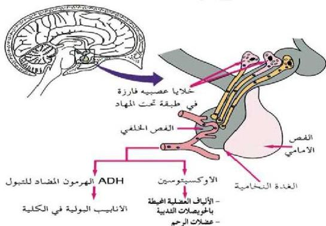

عن طريق إعادة امتصاص الماء بواسطة الأنابيب الكلوية، كما يعمل على زيادة ضغط الدم الشرياني. وهرمون الأوكسيتوسين الذي يعمل على تقليل عضلات الرحم أثناء الولادة، ويستخدم علاجياً لإحداث الطلاق أثناء الولادة المتعمرة، كما يعمل على إطلاق الحليب من الثدي عند الرضاعة.

وهذا يدل على العلاقة الوظيفية بين التنظيم العصبي، والتنظيم الهرموني فعند مص الطفل لثدي أمه تتولد إشارات عصبية ترسل إلى (تحت المهاد)، ليفرز هرمون الأوكسيتوسين الذي يعمل على إطلاق الحليب.

أما محاور المجموعة الثانية فإنها تفرز هرمونات الإطلاق التي تصل إلى الفص الأمامي للغدة النخامية بواسطة الدم، وتحفزه على إطلاق هرموناته.

الشكل (٩) العلاقة بين تحت المهاد والفص الخلفي للغدة النخامية.

لنتعرف على الهرمونات المفرزة من الفص الأمامي وأماكن تأثيرها ادرس الجدول (٣) الآتي:

٥٢

الأحياء للصف الثالث الثانوي

http://E-learning-moe.edu.ye