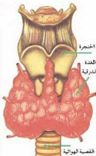
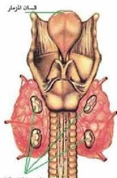

## ٢- الغدة الدرقية : Thyroid Gland

– أين توجد الغدة الدرقية؟

انظر الشكل (١٠) ولاحظ أن الغدة الدرقية تتكون من فصين: أيمن وأيسر يتصلان ببعضهما في الوسط.

وتعد الغدة الدرقية أكبر الغدد الصماء حجماً؛ إذ يصل وزنها حوالي ٢٥٠-٣٠٠ جم، وهي مخزن اليود في الجسم الذي يدخل في عملية تركيب هرمون الفيروكسين Thyroxin من الغدة الدرقية بنسبة ٦٥٪ من وزن الهرمون.

– من أين يحصل الإنسان على عنصر اليود؟

– ما الذي يحدث للغدة الدرقية في حالة نقص عنصر اليود في الجسم؟

• وظيفة هرمون الفيروكسين:

١- تنشيط العمليات الأيضية في خلايا الجسم، وتنظيمها وخاصة عملية الأكسدة.
٢- تنظيم عملية النمو، والتمايز لمعظم خلايا الجسم، وأنسجته المختلفة وخاصة عمليات نمو العظام.

## ٣- الغدد الجاردرقية : Parathyroid Glands

– أين توجد الغدد الجاردرقية، وما وظيفتها؟

الغدد الجاردرقية عبارة عن أربعة فصوص صغيرة جداً، الشكل (١١). وتوجد ملتصقة على السطح الخلفي للغدة الدرقية، وتفرز هرمون الباراثورسون (Parathormone)؛ الذي يقوم بتنظيم نسبة الكالسيوم في الدم، وبقائها في المستوى الطبيعي.

الشكل (١٠) الغدة الدرقية.

الغدد الجاردرقية

الشكل (١١) غدد الجاردرقية.

٥٤

الأحياء: النصف الثالث الثانوي

http://E-learning-moe.edu.ye