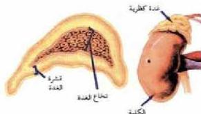

#### ٤- الغدة الكظرية Adrenal Gland (الغدة فوق كلوية) Suprarenal Gland

أدرس الشكل (١٢)، ولاحظ أن الغدة الكظرية عبارة عن غدة صغيرة تقع فوق الكلية، وتتركب كل غدة من طبقتين، طبقة خارجية (القشرة) Cortex، وطبقة داخلية (النخاع) Medulla، وتعد كل طبقة غدة مستقلة عن الأخرى وتقوم كل طبقة بإفراز هرموناتها الخاصة.

#### ١- هرمونات قشرة الغدة الكظرية:

تفرز قشرة الغدة الكظرية ثلاث مجموعات من الهرمونات هي:

#### ١- الهرمونات السكرية:

#### Glucocorticoids Hormones

الشكل (١٢) الغدة الكظرية.

مثل هرمون الكورتيزول Cortisol الذي يتحكم في عمليات أيض الكربوهيدرات. كما تعمل هذه الهرمونات على تحفيز وتحويل البروتينات، والدهون إلى جلوكوز، فيرتفع مستوى الجلوكوز في الدم، كما أن لها تأثير مضاد للالتهابات وخاصة الناتجة عن تلف الأنسجة.

#### ٢- الهرمونات المعدنية Mineralo Corticoids Hormones

من أهمها هرمون الأندوستيرون Aldosterone الذي يعمل على حفظ معدل الصوديوم في الدم، إذ يقوم الهرمون بتحفيز عملية إعادة امتصاص أيونات الصوديوم، والكلوريد، في تفرونات الكلية في عملية تسمى تنظيم التوازن الملحي.

#### ٣- الهرمونات الجنسية: Sex Hormones

مثل هرمون الاستروجين Oestrogen الذي له تأثير كبير في إظهار صفات البلوغ الثانوية عند الفتاة، وكذا هرمونات الأندروجين Androgen التي يكون لها نفس الدور بالنسبة للفتى.

- ما شعورك عند دخولك الامتحان؟

- ما التغيرات التي تحدث لجسمك عند تعرضك لأي إحراج أو خوف؟
- ما سبب هذه التغيرات؟

الأحياء الصف الثالث الثانوي

http://E-learning-moe.edu.ye