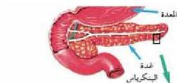
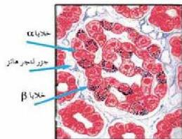

## ب- هرمونات نخاع الغدة الكظرية:

يقوم نخاع الغدة الكظرية بإفراز هرمون الأدرينالين Adrenaline ووظيفته تهيبة، وإعداد الجسم لاستقبال، وإجتياز المواقف الانفعالية والحرجة في الحالات الطارئة، مثل الخوف، والغضب، ويجعله يتهيأ لها للقتال أو الهروب وتوفير ما يلزم لذلك من طاقة، وينتج عن إفراز هرمون الأدرينالين وارتفاع تركيزه في الدم كثير من التغيرات الفسيولوجية التي تؤدي إلى زيادة إنتاج الطاقة. ومن هذه التغيرات التي يحدثها هرمون الأدرينالين ما يأتي:

- زيادة سرعة وشدة نبضات القلب، حتى تزيد مقدار كمية ما يضعه القلب من دم.
- توسيع الأوعية الدموية المتصلة بالعضلات الإرادية والجلد وانقباضها في العضلات اللاإرادية.
- يقلل من زمن تجلط الدم عند النزف نتيجة انقباض الأوعية الدموية، ويستخدم موضعياً في وقف النزيف الجلدي والزعاف.
- اتساع الشعب الهوائية لدخول كمية كبيرة من الأوكسجين إليها، وتوليد أكبر كمية من الطاقة اللازمة.
- زيادة نسبة السكر في الدم.
- يعمل على اتساع حدقة العين فيتسع مجال الرؤية.

## ج- جزر لانجرهانز البنكرياسية:
Islands of Langerhans

- أين يوجد البنكرياس؟
- إلى أين تصب عصارتها الهاضمة؟
- كيف يعمل البنكرياس كغدة صماء؟
- ما الهرمونات التي يفرزها؟
- يحتوي البنكرياس على مجموعة من الخلايا الغنية جداً بالأوعية الدموية، التي تشكل جزراً صغيرةً مبعثرة فيها تسمى جزر لانجرهانز نسبة للعالم الذي اكتشفها، شكل (١٣). وهذه الجزر تفرز هرموناتها إلى الدم مباشرة.

الشكل (١٣) جزر لانجرهانز البنكرياسية.

٥٦

الأحياء للصف الثالث الثانوي

http://E-learning-moe.edu.ye