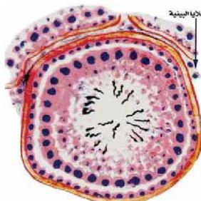

## ٧- هرمونات المناسل:

– لماذا يعتبر كل من الخصية والمبيض غداً صماء؟

المناسل عبارة عن الخصية في الذكر، والمبيض في الأنثى وتقوم هذه الأعضاء بوظائف عدة أهمها:

١- تكوين الأمشاج الذكرية، والأنثوية.

٢- إفراز الهرمونات الجنسية.

– ما الهرمون الذي يفرز من الخصية؟ وما وظيفته؟

– ما الهرمون الذي يفرز من المبيض؟ وما وظيفته؟

– يوضح الجدول (٦) بعض هرمونات الغدد التناسلية وأماكن إفرازها وتأثيرها.

الشكل (١٤) قطاع عرضي في الخصية بين الخلايا البيئية.

جدول (٦) هرمونات الغدد التناسلية

|  الهرمون | مكان الإفراز | الوظيفة  |
| --- | --- | --- |
|  التستوستيرون Testosterone | الخصية (الخلايا البيئية) شكل (١٤) | – تساهم في بناء الجسم وتبرز في الفتى مظاهر الرجولة. – تعمل على استكمال نمو الجهاز التناسلي الذكري.  |
|  الاستروجين Estrogen | المبيض، (الخلايا البيئية) | – يعمل على استكمال نمو الجهاز التناسلي الأنثوي ويظهر الصفات الجنسية الأنثوية.  |
|  البروجسترون Progesterone | – الجسم الأصفر في المبيض | – تهيئة الرحم للحمل، واستقبال البويضة الخصبة. – يمنع تكوين بويضات جديدة.  |

## أمراض الجهاز الهرموني وصحته:

### أ- أمراض الغدد الصماء:

١- تضخم الغدة الدرقية:

– الأعراض: تضخم الغدة الدرقية وزيادة حجمها.

– أسبابه: نقص اليود في الغذاء.

– الوقاية منه: إضافة اليود إلى ملح الطعام ومياه الشرب.

٥٨

الأحياء: النصف الثالث الثانوي

http://E-learning-moe.edu.ye