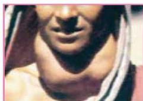

# ٢- كزاز الجاردرقية :

- أسبابه: نقص أملاح الكالسيوم في الدم.
- الأعراض: ظهور تشنجات عصبية وعضلية.
- علاجه: حقن المريض بهرمون الباراثورمون مع تعاطي أملاح الكالسيوم.

# ٣- السكري :

ينتج هذا المرض بسبب نقص إفراز هرمون الأنسولين، وينتج عن هذا النقص عجز الجسم عن الاستفادة من السكر في إنتاج الطاقة، ويؤدي ذلك إلى ارتفاع نسبة السكر في الدم وخروجه مع البول.
- أسبابه: كثيرة، فقد يكون إما بسبب العوامل الوراثية، أو زيادة الوزن الناتج عن السمنة، أو الحمل، وأمراض الكبد والبنكرياس، أو ممارسة عادات غير صحية كتناول الخمور .. إلخ.
- أعراضه: كثرة التبول، والشعور الدائم بالعطش، ونقصان الوزن، ودوخة شديدة، والشعور بالجوع والتعب والإجهاد السريع لأقل مجهود، والتأخر في التئام الجروح، وفي المراحل المتقدمة يؤثر على القلب والعين ويؤدي إلى الإغماء (صدمة السكر).
- علاجه: يتم إما عن طريق حقن الأنسولين في الجسم أو استخدام بعض الحبوب المنشطة للبنكرياس، إلى جانب الالتزام بالحمية الغذائية، وتنقيص الوزن، وممارسة الرياضة.

# صحة الجهاز الهرموني :

للمحافظة على سلامة الغدد الصماء يجب اتباع الآتي :

١- تناول وجبات غذائية متزنة تحتوي على مقادير ملائمة من البروتينات والدهون اللازمة لتكوين مختلف الهرمونات.
٢- ممارسة التمارين الرياضية التي تعمل على تنشيط الدورة الدموية.
٣- الامتناع عن تعاطي الكحول والمخدرات التي تؤدي إلى تلف الغدد الصماء، والأعضاء المهمة كالكبد والبنكرياس.
٤- عدم استخدام الأدوية إلا بعد استشارة الطبيب.

وبهمننا أن نعرف أنه نتيجة للتقدم العلمي وخاصة الهندسة الوراثية أصبح من الممكن إنتاج معظم الهرمونات عن طريق التقانة الحيوية، مثل الأنسولين، والاستفادة منها في علاج المرض.

الأحياء للصف الثالث الثانوي

٥٩

http://E-learning-moe.edu.ye