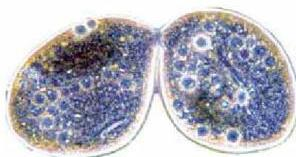
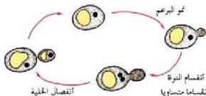

## التكاثر Reproduction

ما سبب استمرار بقاء الكائنات الحية على الأرض منذ ملايين السنين؟
خلق الله تعالى الكائنات الحية وأودع فيها آلية إنتاج أفراد جديدة منها.
لتضمن استمرار حياة نوعها، وهذه الآلية تعرف بالتكاثر. فتخيل ماذا يحدث إذا لم تستطع هذه الكائنات الحية التكاثر؟ إن استمرارية بقاء الكائنات المختلفة على سطح الأرض تعتمد على التكاثر الذي يحدث بطريقتين رئيسيتين هما: التكاثر الجنسي والتكاثر اللاجنسي الذي يحدث في معظم الكائنات الحية، وهناك كائنات حية أخرى تعتمد على الطريقتين في تكاثرها.

### التكاثر اللاجنسي: Asexual Reproduction

– ما المقصود بالتكاثر اللاجنسي؟

تكون الأفراد الناجمة عن هذا التكاثر مماثلة في جميع صفاتها للأصل. ويتم التكاثر اللاجنسي عادة بالانقسام المتساوي لخلايا الأصل ويمكن أن يحدث هذا الانقسام على مستوى عضيات الخلايا. ولهذا التكاثر أشكال عديدة منها:

#### ١- الإنشطار الثنائي: Binary Fission

– ماذا يقصد بالإنشطار؟

انظر الشكل (١) ولاحظ كيفية انقسام البراميسيوم حيث تنقسم الخلية إلى خليتين، كما يحدث ذلك أيضاً في البكتيريا والأوليات مثل البوجلينا وبعض الفطريات.

#### ٢- التبرعم: Budding

لاحظ الشكل (٢). ماذا يظهر على الجدار الخلوي في فطر الخميرة؟ وماذا يحدث للنواة؟

بعد ظهور بروز في الجدار الخلوي تنقسم النواة انقساماً متساوياً لتعطي نواتين تتجه إحداهما إلى البروز، وتبقى الأخرى في الخلية الأم.

الشكل (١) الإنشطار في البراميسيوم

الشكل (٢) التبرعم في الخميرة

٦٢

الأحياء: النصف الثالث الثانوي

http://E-learning-moe.edu.ye