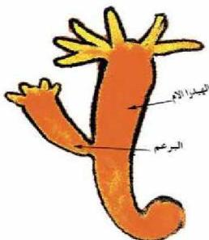

الشكل (٣) التبرعم في الهيدرا

– ماذا يطلق على البروز الناجم؟
ينفصل البروز الناجم بعد تخصيص
في الجدار الخلوي وينمو ليعطي فطراً
جديداً.

لاحظ الشكل (٣). كيف
يحدث التبرعم في الهيدرا؟

يتكون البرعم قرب القاعدة
بسبب انقسام الخلايا هناك، وينفصل
البرعم بعد أن تنمو اللوامس مكوناً
هيدرا جديدة.

# النقاط (١)

■ نفذ النشاط: التكاثر بالتبرعم في فطر الخميرة في كراس الأنشطة
والتجارب العملية.

# ٣- القطع والتجديد : Cutting and Regeneration

– ماذا يحدث في حالة قطع الإسفنج إلى قطع صغيرة وتركها في البيئة نفسها؟
الإسفنج من الكائنات عديدة الخلايا وبسيطة التركيب، فعندما يحدث لها قطع
أو تمزق فإن القطع تنمو إلى أفراد جديدة وذلك لقدرة خلاياها على الانقسام، وتقل
هذه القدرة برقي الكائن الحي، ففي الإنسان يتمثل ذلك بالتغام الجروح وجبر العظام
بعد كسرها، وتجديد الدم وتجديد ما يستأصل من الكبد جراحياً.

# ٤- التبوغ (التجوثم) : Sporulation

– ما البوغ ؟ وكيف يتكون ؟
– اذكر بعض الكائنات الحية التي يتم فيها التكاثر بتكوين الابراغ ؟
تتم طريقة التكاثر بالتبوغ في بعض الكائنات الدنيا مثل الطلائعيات،
والفطريات .

الأحياء للصف الثالث الثانوي

٦٣

http://E-learning-moe.edu.ye