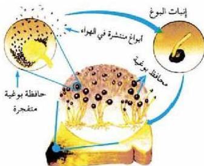

الشكل (٤) التكاثر بالتبوغ في فطر عفن الخبز

لاحظ تكاثر فطر عفن الخبز في الشكل (٤).

يحدث في الخلايا البوغية انقسامات متساوية، ينتج عنها خلايا أحادية المجموعة الكروموسومية تسمى أبواغاً، والتي تضغط على جدار الحافظة البوغية فتتفجر وتخرج منها الأبواغ التي يساعد حجمها الصغير على الانتشار

في الهواء. وتتميز هذه الأبواغ بالقدرة على النمو في بيئات تتصف بدرجة الحرارة والرطوبة وتوفر المواد العضوية لتعطي أفراداً جديدة، فمثلاً يستطيع الفرد الواحد من عش القراب أن ينتج 500.000 بوغ ينمو كل منها إلى فطر جديد ليعيد دورة الحياة مرة أخرى.

## النشاط (٢)

• نفذ النشاط : التكاثر بالتبوغ في كتاب الأنشطة والتجارب العملية.

### •- التكاثر الخضري : Vegetative Reproduction

– ما المقصود بالتكاثر الخضري؟

يحدث هذا النوع من التكاثر بشكل طبيعي في النباتات الزهرية، وذلك بنمو الأجزاء الخضرية (الورقة أو الساق أو الجذر) لتكون أنسجة تمتاز إلى أفراد جديدة تتفصل عن النبات الأم، ويستخدمه المزارعون لإكثار المنتجات الزراعية وضمان الصفات الجيدة التي توجد في النبات الأصلي، وكسب الوقت في الإنتاج. ويتم التكاثر الخضري إما بطريقة طبيعية أو صناعية، وذلك كما يأتي:

#### أ - طرق التكاثر الخضري الطبيعي:

ادرس الجدول رقم (١) مستعيناً بالشكل (٥) ثم أجب عن الأسئلة التي تلي ذلك.

٦٤

الأحياء للصف الثالث الثانوي

http://E-learning-moe.edu.ye