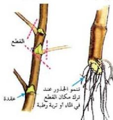

- ما طرق التكاثر الخضري الطبيعي؟
- حدد عضو التكاثر في كل طريقة؟ وماذا يقصد به؟
- اذكر مثلاً لكل طريقة من طرق التكاثر الخضري الطبيعي؟ وبين آلية التكاثر فيه؟

### النشاط (٢)

• نفذ النشاط الخاص بالتكاثر الخضري الطبيعي في كتاب الأنشطة والتجارب العملية.

# ب- التكاثر الخضري الصناعي:

العامل المشترك في هذا النوع من التكاثر هو أن يقطع الإنسان جزءاً من النبات كالساق أو الجذر أو الأوراق، وجعله ينمو إلى نبات كامل. ورغم أن الإنسان يستعمل وسائل التكاثر الخضري الطبيعي إلا أنه استحدث طرقاً أخرى لإكثار النباتات اقتصادياً منها:

# - التعقيل : Slipsor

ما العُقَلة؟ وكيف يمكن الحصول على أفضلها؟

الزراعة بالعُقَل كما في نبات الجيرانيوم وتتم بقطع جزء من الساق يحتوي على برعمين أو ثلاثة على الأقل، وأفضلها وسط الفرع بحيث يقص الربع العلوي والربع السفلي ويؤخذ النصف المتوسط. وتُزرع العُقَل في بيئة مناسبة بأن يترك برعم في

الشكل (٦) الإكثار بالعُقَل

الهواء والبرعم الثاني في مستوى سطح التربة، حيث تنمو جذور عرضية من مكان قطع الساق. ويستخدم التعقيل في العديد من نباتات الزينة مثل الورد والياسمين، وبعض النباتات الاقتصادية كالعنب والتين.

### النشاط (٤)

• نفذ النشاط الخاص بتكثير النباتات بالتعقيل في كتاب الأنشطة والتجارب العملية.

- كيف يتم تحفيز عملية نمو الجذور في كثير من عَقَل النباتات.

الأحياء للصف الثالث الثانوي

٦٧

http://E-learning-moe.edu.ye