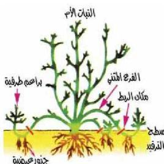
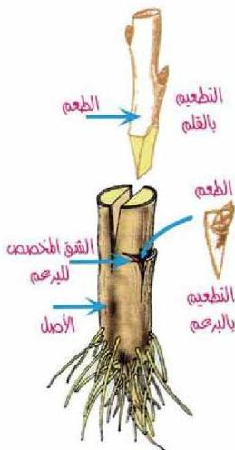

## - الترقيد : Layering

لاحظ الشكل (٧) الذي يبين كيفية
إستخدام طريقة دفن سيقان وأفرع بعض
النباتات كالعنب والياسمين في التربة على
عمق ٢٥ سم، وهو لا يزال متصلاً بالنباتات
الأصل ثم ثني طرف الفرع إلى أعلى فوق
سطح التربة ويثبت في وضع قائم فتنمو له
جذور عرضية وتنمو البراعم كذلك،
ويترك الفرع النامي متصلاً بالنباتات الأصل
فترة قصيرة من الزمن ثم يفصل عنه
ليستقل بنفسه.

## - التطعيم : Grafting

تستعمل هذه الطريقة لتحسين أشجار
الفواكه، وفيها يتم نقل قطعة من ساق
نبات معين عليه براعم، وتعرف بالطعم،
وتلصق بساق نبات آخر من نفس النوع أو
الجنس، ويعرف بالأصل ليستفيد الطعم
من المجموع الجذري للأصل بينما يستفيد
الأصل من المجموع الخضري للطعم. وهناك
طرق مختلفة للتطعيم ويوضح (الشكل ٨)
بعضها، ومنها:

### - التطعيم بالبرعم :

ويتم بأخذ برعم كامن تام النمو من
نبات ذي صفات مرغوبة يراد إكثاره
ويوضع في شق على شكل حرف T في
النباتات المطعم الشكل (٨)، بحيث تنطبق
أنسجة كامبيوم البرعم على كامبيوم الأصل
ثم يربط عليهما برباط محكم، وبعد مدة
ينمو البرعم ليكون النبات الجديد.

الشكل (٧) الإكثار بالترقيد

الشكل (٨) الإكثار بالتطعيم

٦٨

الأحياء للصف الثالث الثانوي

http://E-learning-moe.edu.ye