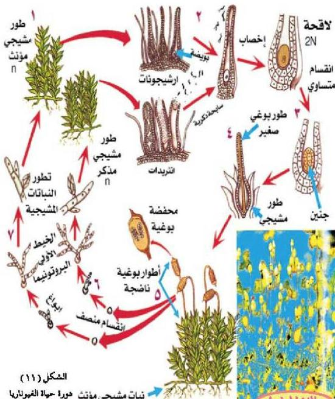

– ماذا يسمى تتابع الطورين المشيجي والبوغي في دورة حياة الفيوناريا ؟
تُتبع دورة حياة نبات الفيوناريا في الشكل (١١)، ولاحظ أن النبات يمر بطورين أثناء دورة الحياة، وهما الطور المشيجي، والطور البوغي.

الشكل (١١)

نبات مشيجي مؤنث دورة حياة الفيوناريا

• نفذ النشاط الخاص بفحص عينة محفوظة وشرائح مجهرية لنبات الفيوناريا
والمتضمن في كتاب الأنشطة والتجارب العملية.

الأحياء للصف الثالث الثانوي

٧٣

http://E-learning-moe.edu.ye