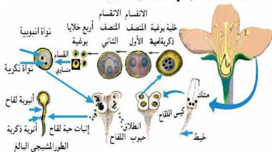

## ٢- التكاثر الجنسي في النباتات الزهرية:

– أين يتم التكاثر الجنسي في النباتات الزهرية؟ وكيف يتم ذلك؟
يتم التكاثر الجنسي في النباتات الزهرية بتكوين الأمشاج المذكورة (حبوب اللقاح) في الملك والأمشاج المؤنثة (البويضات) في المبيض، ثم إندماج محتويات حبة اللقاح مع البويضة لتكوين اللقاحة «Zygote».

– ما الأجزاء الزهرية التي تنتج الأمشاج؟
تتكون حبوب اللقاح في الملك والبويضات في المبيض. وهناك نوعان من الأزهار هما:
أ – أزهار ثنائية الجنس: Bisexual (أحادية المسكن) تحتوي الزهرة على أعضاء التذكير والتأنيث معاً، كما في نباتات الغول والمشمش والصنوبر.

ب – أزهار أحادية الجنس: Monosexual (ثنائية المسكن)
تحتوي الزهرة على أعضاء التذكير أو أعضاء التأنيث كما في نبات النخيل.

**تكوين حبوب اللقاح والبويضات في الزهرة** يمكن توضيح خطوات تكوين حبوب اللقاح والبويضات في النبات كما يأتي:

### أولاً: خطوات تكوين حبوب اللقاح

انظر الشكل (١٢) ولاحظ أن المُمك يتكون عادة من أربعة أكياس تنمو فيها الخلايا البوغية الذكرية الأم التي تحتوي على (2n).

الشكل (١٢) خطوات تكوين حبوب اللقاح

٧٤

الأحياء النصف الثالث الثانوي

http://E-learning-moe.edu.ye